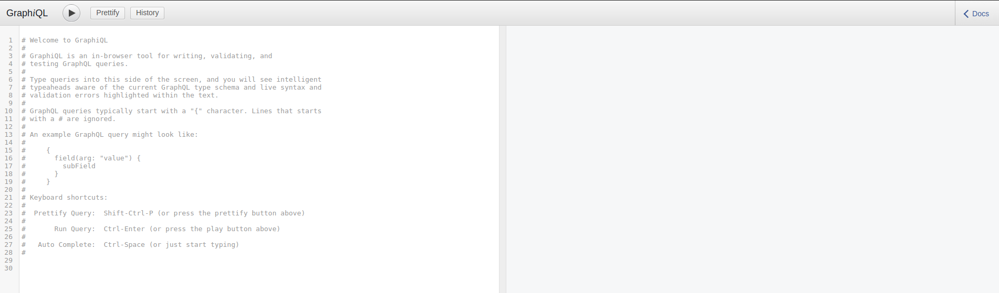
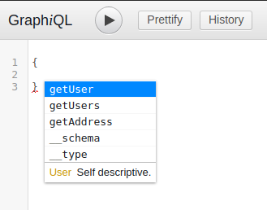
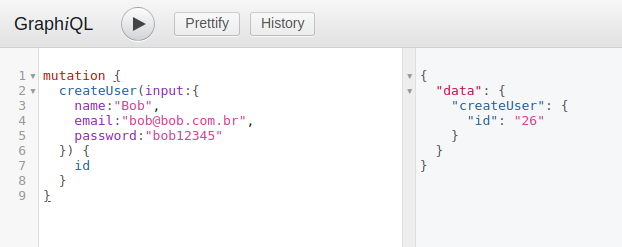
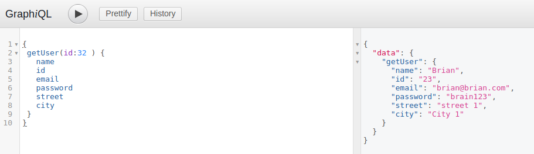

# Projeto Modelo GraphQl + NodeJs


[](https://github.com/devfullstack77/cadastro-nestjs/issues) [](https://github.com/devfullstack77/cadastro-nestjs/network) [](https://github.com/devfullstack77/cadastro-nestjs/stargazers) [](https://github.com/devfullstack77/cadastro-nestjs/blob/main/LICENSE) 


## Descrição
Projeto template para o entendimento do GraphQl com Node Js

## Objetivo
Um template de uso rápido e fácil para evidenciar as diferenças entre GraphQl e Rest.
GraphQl sendo mais adequado para os casos onde há muitos serviços múltiplos.

## 🚀 Tecnologias utilizadas
- [Node.js](https://nodejs.org/en/)
- [Knex js](https://https://knexjs.org//)
  - [Knex cheatsheet](https://devhints.io/knex)
- [express-graphql](https://graphql.org/graphql-js/express-graphql/)
- [graphql-tools]( )
- [mysql](https://www.npmjs.com/package/mysql)

## 🎲 Instalação

1- Instalação Global da lib Knex.
```bash
sudo npm i -g knex
```

2- Iniciando Docker < MySql >

```bash
├── docker
│   └── docker-compose.yml

$ docker-compose up -d
```

2- Crie um arquivo **.env** para usar informar a senha do usuario para conectar a base.
```bash
module.exports = {
    password: 'admin'
}
```

4- Crie a base graphql.

```bash
CREATE DATABASE  graphql
```

5- Rodar o comando para criar o migrations das tabelas Users e Address.
```bash
$ knex migrate:latest
```

6- Instalando dependências

```bash
$ npm install
```

## ✨ Iniciando a aplicação
```bash
$ node src/server.js
```

Rodando na porta 4000
```bash
 http://localhost:4000
```

#### ✅ GraphiQL Interface
```bash
  http://localhost:4000/api
```



**GraphiQL tem o recurso de autocompete**



**Exemplos de consulta e inserção de dados**


> Inserindo dados na tabela de Usuario (Users)
>```bash
>mutation {
>  createUser(input:{
>    name:"Bob",
>    email:"bob@bob.com.br",
>    password:"bob12345"
>  })
>}


> Incluindo dados de usuário e endereço
>```bash
>mutation {
>   createUserAddress(input:{
>    name:"Brian",
>    email:"brian@brian.com",
>    password:"brain123",
>    street:"street 1",
>    city:"City 1"
>  })
>}



> Listando todos os usuários
>> Na mesma chamada pegamos os dados de relacionados em tabelas diferentes.
>```bash
>{
>  getUsers {
>    name
>    id
>    email
>    password
>    street
>    city
>  }
>}

> Localizando por ID do usuário
>```bash
>{
> getUser(id:32 ) {
>   name
>   id
>   email
>   password
>   street
>   city
> }
>}


- **Observação:**
  - **Resolvers**
    Funções como obter os dados no Graphql
  - **Mutations**
    Operações que causam alterações: Delete, update, insert
  - **Schema**
    São os atributos disponiveis para consulta e/ou alteração
  - **graphql-tools**
    Transformar o schema, sendo string em executavel

 ## Estrutura de pastas

```bash
├── package.json
├── README.md
└── src
    ├── api
    │   ├── resolvers.js
    │   └── schema.js
    ├── config
    │   └── database.js
    ├── docker
    │   └── docker-compose.yml
    ├── knexfile.js
    ├── migrations
    │   ├── 20211105173145_create_table_users.js
    │   └── 20211113004627_create_table_address.js
    └── server.js
```
